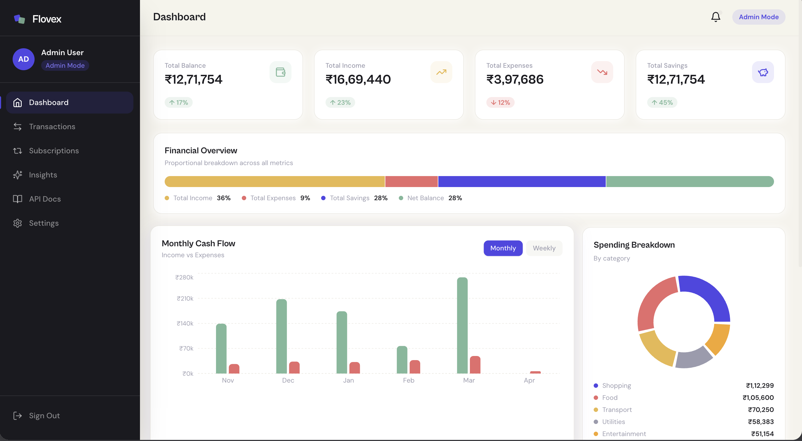

# Flovex — Financial Dashboard

> **"Your wealth, flowing forward."**

A full-stack financial dashboard built as an assignment submission for the **Frontend Developer** role at **Zorvyn.io**. It demonstrates production-grade React architecture, real-time data visualisation, role-based access control, and a clean RESTful API — all deployed on modern cloud infrastructure.



---

## Live Demo

| Service  | URL                                                  |
|----------|------------------------------------------------------|
| Frontend | https://flovex.vercel.app                            |
| API      | https://flovex-api.vercel.app                        |

---

## Tech Stack

| Layer       | Technology                                      |
|-------------|-------------------------------------------------|
| Frontend    | React 18 + Vite 5                               |
| Styling     | Tailwind CSS 3 (custom brand tokens)            |
| Animations  | Framer Motion 11                                |
| Charts      | Recharts 2                                      |
| State       | Redux Toolkit + RTK Query                       |
| Routing     | React Router DOM v6                             |
| Icons       | Lucide React                                    |
| Fonts       | Cabinet Grotesk (display) · DM Sans (body)      |
| Backend     | Node.js 18 + Express 4                          |
| Database    | MongoDB Atlas + Mongoose 8                      |
| Scheduling  | node-cron (daily subscription billing)         |
| Deployment  | Vercel (frontend) + Render (backend)            |

---

## Repository Structure

```
Assignment/
├── flovex-client/          # React + Vite SPA
│   ├── src/
│   │   ├── components/     # Shared UI — cards, modals, sidebar, charts
│   │   ├── hooks/          # Custom hooks (useCountUp, etc.)
│   │   ├── pages/          # Route-level views
│   │   └── store/api/      # RTK Query service definitions
│   ├── vercel.json         # SPA rewrite rule for Vercel
│   └── README.md           # Frontend setup & Vercel deployment guide
│
└── flovex-server/          # Express + MongoDB REST API
    ├── src/
    │   ├── controllers/    # Business logic
    │   ├── models/         # Mongoose schemas
    │   ├── routes/         # API routers
    │   ├── jobs/           # Cron job logic
    │   └── data/seed.js    # Database seed script
    └── README.md           # Backend setup & Render deployment guide
```

---

## Features

### Dashboard
- Real-time KPI cards — total balance, income, expenses, savings rate
- Animated number count-up on every page load
- Weekly income-vs-expense bar chart
- Monthly 6-month trend area chart
- Category spending ring chart
- 5 most-recent transactions feed

### Transactions
- Full CRUD — create, edit, delete (Admin only)
- Server-side search, filter by category/type, sort, pagination
- Inline form modal with validation

### Subscriptions
- Track recurring bills (Netflix, rent, utilities, etc.)
- Automatic daily billing via node-cron
- Manual trigger via API endpoint

### Insights
- Category breakdown with drill-down trend chart
- Savings rate ring animated on viewport entry
- AI-style insight cards generated from live data

### Settings
- Role toggle between Admin and Viewer
- One-click CSV export of all transactions

---

## Pages & Routes

| Route                        | Description                                        |
|------------------------------|----------------------------------------------------|
| `/`                          | Landing page with animated hero                    |
| `/login`                     | Role selection — Admin or Viewer                   |
| `/dashboard`                 | Overview stats, charts, recent transactions        |
| `/dashboard/transactions`    | Full transaction table with CRUD (Admin gated)     |
| `/dashboard/insights`        | Visual analytics and AI-style insights             |
| `/dashboard/subscriptions`   | Recurring billing tracker                          |
| `/dashboard/settings`        | Role toggle, CSV export                            |

---

## Role-Based Access

| Feature              | Admin | Viewer |
|----------------------|:-----:|:------:|
| View dashboard       | ✓     | ✓      |
| View transactions    | ✓     | ✓      |
| Add transaction      | ✓     | ✗      |
| Edit transaction     | ✓     | ✗      |
| Delete transaction   | ✓     | ✗      |
| Export CSV           | ✓     | ✗      |
| Manage subscriptions | ✓     | ✗      |
| Change role          | ✓     | ✓      |

Role is stored in `localStorage` and persists across browser refreshes.

---

## API Reference

Full documentation lives in [flovex-server/README.md](./flovex-server/README.md). Quick summary:

| Group          | Base Path              |
|----------------|------------------------|
| Transactions   | `/api/transactions`    |
| Dashboard      | `/api/dashboard`       |
| Charts         | `/api/charts`          |
| Subscriptions  | `/api/subscriptions`   |
| Health check   | `/api/health`          |

---

## Running Locally

### Prerequisites

- Node.js 18+
- MongoDB (local or Atlas)

### 1. Clone and install

```bash
git clone <your-repo-url>
cd Assignment
```

### 2. Start the backend

```bash
cd flovex-server
npm install
cp .env.example .env        # edit MONGODB_URI if needed
npm run seed                 # seed 33 realistic transactions
npm run dev                  # → http://localhost:5001
```

### 3. Start the frontend

```bash
cd flovex-client
npm install
cp .env.example .env         # leave VITE_API_URL empty for local dev
npm run dev                  # → http://localhost:5700
```

The Vite dev proxy forwards all `/api/*` requests to the backend automatically.

---

## Deployment

### Backend → Render

See the full step-by-step guide in [flovex-server/README.md](./flovex-server/README.md#deploying-to-render).

Quick overview:
1. Create a **Web Service** on Render pointed at `flovex-server/`
2. Set `MONGODB_URI`, `NODE_ENV=production`, and `ALLOWED_ORIGINS` (your Vercel URL)
3. Build command: `npm install` — Start command: `npm start`
4. Copy the generated `https://flovex-api.vercel.app` URL

### Frontend → Vercel

See the full step-by-step guide in [flovex-client/README.md](./flovex-client/README.md#deploying-to-vercel).

Quick overview:
1. Create a **Project** on Vercel pointed at `flovex-client/`
2. Set `VITE_API_URL` to your Render service URL
3. Framework: Vite — Build: `npm run build` — Output: `dist`
4. The `vercel.json` rewrite rule handles SPA client-side routing automatically

---

## Animation Highlights (Framer Motion)

| Interaction                | Technique                                          |
|----------------------------|----------------------------------------------------|
| Page transitions           | `AnimatePresence` fade + slide on route change     |
| Card entrances             | `staggerChildren` spring animations                |
| KPI number count-up        | `useCountUp` hook with `requestAnimationFrame`     |
| Charts                     | Recharts `isAnimationActive` + staggered durations |
| Hover on cards/buttons     | `whileHover` scale transforms                      |
| Savings ring               | SVG `stroke-dashoffset` on viewport entry          |
| Sidebar active indicator   | `layoutId` shared layout animation                 |

---

## Known Limitations

- Authentication is simulated — role is stored in `localStorage`, not a real auth token
- Chart data and stats are computed at query time; no server-side caching layer
- The Render Free tier spins down after inactivity — first cold-start request takes ~30 s
